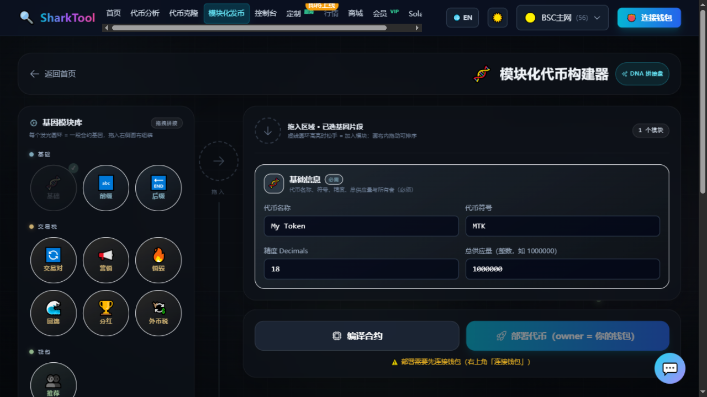

# 模块化发币

**入口**：顶部导航「模块化发币」

像搭积木一样组装代币：左边是功能模块库，拖到右边画布上组合，实时校验冲突，编译后一键部署。**内置 23 个功能模块**。

**前置条件**：

- 在右上角选好网络。
- **必须先编译，再部署；部署必须连接钱包**。
- **收费**：收平台服务费，随部署交易一次性支付（只需一次签名）；会员有效期内免费。

---

## 操作步骤

1. **从左侧「基因模块库」拖拽模块到右侧画布**。画布中间有个虚线圆环，高亮时松手即加入，提示「已添加「XXX」」。
2. 模块在画布上**可以拖动排序**，点卡片右上角的垃圾桶图标可以移除。
3. **在模块卡片里填参数**（见下方模块清单）。
4. 添加模块时会**实时校验**：有依赖缺失、税率超限、机制冲突会立刻弹出提醒。
5. 点 **「编译合约」**，成功后提示「✅ 合约编译成功！可部署」。
6. 点 **「部署代币（owner = 你的钱包）」**，钱包签名确认。
7. 成功后提示 **「🎉 模块化代币部署成功！已加入控制台」**，页面提供「在区块浏览器查看」「前往控制台管理」「再部署一个」。
8. 如果用了含税模块，还需要**注册 AMM 交易对**（见下）。

---

## 功能模块清单（23 个）

| 分类 | 模块 |
|---|---|
| **基础** | 基础信息（必需，不可移除）、地址前缀、地址后缀 |
| **交易税** | AMM 交易对、营销税、销毁税、回流税、分红税、外币税（集收转兑） |
| **钱包** | 推荐奖励（多级） |
| **供应量** | 增发代币、销毁代币、自动空投、黑洞分红、持币复利、底池燃烧、LP 挖矿、314 协议 |
| **开关与限制** | 交易开关、单笔交易上限、最大持仓量、黑名单、杀区块（KillBlock 反狙击） |

### 常用参数举例

- **基础信息**：代币名称、代币符号、精度 Decimals、总供应量
- **营销税 / 销毁税 / 回流税 / 分红税**：买入税率、卖出税率（百分比，填 `2` 就是 2%），以及对应的钱包地址
- **外币税（集收转兑）**：税基货币（本币 / USDT / USDC / 自定义代币）、买入与卖出外币税率、收款钱包、外币交易对地址、DEX 路由器地址等
- **单笔交易上限 / 最大持仓量**：填代币数量，`0` 表示不限
- **杀区块**：监控块数量 n、路由器地址
- **地址前缀 / 地址后缀**：指定部署出来的合约地址前缀或后缀，支持 EIP-55 大小写精确匹配

---

## 自定义合约地址（地址前缀 / 后缀）

这是模块化发币的一个特色：可以让部署出来的合约地址**以你指定的字符开头或结尾**。

- 搜 1–2 位很快，3–4 位较慢，**超过 4 位可能需要很长时间甚至找不到**。
- 搜索过程中会显示「已尝试 XXX 次」的进度。
- 开启「区分大小写」后匹配更严格，搜索时间大约是 2 倍以上。
- 前缀/后缀只能填十六进制字符（0–9、a–f）。

---

## 含税模块必须注册 AMM 交易对

⚠️ **税只会对「注册过的真实交易池」生效。** 如果只加了税模块、没绑定交易对，税是收不到的。

部署成功后：

1. 在 **「注册 AMM 交易对（买卖税生效前提）」** 区块里，粘贴你的交易对地址。
2. 点 **「✅ 注册（启用税）」**，成功后买卖税开始生效，税会按方向分流到营销 / 销毁 / 回流 / 分红。
3. 想关掉可以点「取消注册」。

---

## 常见提示

| 提示 | 说明 |
|---|---|
| `⚠️ 部署需要先连接钱包（右上角「连接钱包」）` | 未连接钱包 |
| `请先编译合约` | 直接点了部署 |
| `必须包含「基础信息」模块` | 基础信息是必需的 |
| `「XXX」依赖「YYY」，请先添加` | 模块有依赖关系 |
| `「营销税」必须填写营销钱包地址` | 参数没填全 |
| `买入总税率 XX% 必须小于 25%` | 买卖总税率有上限 |
| `遗漏模块：已启用税模块，但缺少「AMM 交易对」模块…` | 补上 AMM 交易对模块 |
| `前缀/后缀只能包含十六进制字符 (0-9, a-f)` | 地址前缀/后缀格式错误 |
| `⚠️ 已启用税模块，但画布上还没有「AMM 交易对」模块…` | 警告，不影响部署但税不生效 |

---

## 部署完之后

- 代币会**自动加入「控制台」**，可以去那里改税率、调开关、加黑名单等。
- 详见 [代币控制台](console.md)。
