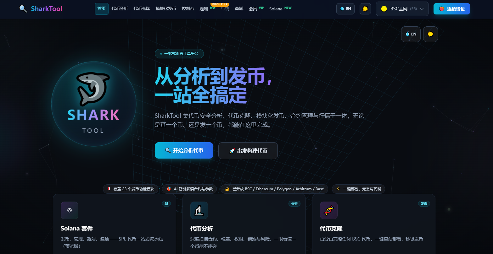

# 🦈 SharkTool Docs

Welcome to **SharkTool** — the all-in-one toolkit for crypto. Here is a step-by-step guide from zero, with one page per feature. Just follow along.

> Website: <https://sharktool.shop>

---

## What this guide helps you do

| I want to… | Read this page |
|---|---|
| Connect a wallet and switch networks | [Quick start](quickstart.md) |
| Check a token for risks and tax rates | [Token Analyzer](analyze.md) |
| Clone an existing token | [Token Cloner](launch.md) |
| Assemble a new token with taxes & mechanics | [Modular Launchpad](builder.md) |
| Manage tokens you've launched (change tax, blacklist…) | [Token Console](console.md) |
| Launch an SPL token on Solana | [Solana Launch](solana-token.md) |
| Generate a Solana vanity address | [Solana Vanity](solana-vanity.md) |
| Create / remove a liquidity pool for a Solana token | [Solana Liquidity](solana-liquidity.md) |
| Batch send, airdrop, consolidate, check concentration & authorities | [Solana Tools](solana-tools.md) |
| See what Membership saves you | [Membership](membership.md) |
| Understand launch service fees | [Service Fees](fees.md) |
| Buy ready-made tool source code | [Source-code Shop](shop.md) |
| Custom development | [Custom](custom.md) |
| Know whether your private key is ever touched | [Security & Risks](security.md) |

---

## Three-minute start

1. **Open the website** <https://sharktool.shop> and click **“👛 Connect Wallet”** in the top-right. Pick MetaMask / a browser wallet, or scan the QR code with a mobile wallet.
2. **Pick a network in the top-right** (BSC Mainnet, Ethereum, Polygon, Arbitrum, Base, etc.). The site will prompt your wallet to switch along.
3. **Pick a tool and go**: to research a token, open “Token Analyzer”; to launch one, open “Token Cloner” or “Modular Launchpad”.

> 💡 Browser wallets (MetaMask, etc.) are best used on desktop. On mobile, scan with WalletConnect — it works across the whole site after you connect once.

---

## Feature overview

| Feature | Entry | One-liner | Cost |
|---|---|---|---|
| Home | Home | Overview of all tools | Free |
| Token Analyzer | Token Analyzer | Contract basics + 14 risk checks | Free |
| Token Cloner | Token Cloner | Source-level 100% clone of an existing token | 0.1 BNB (BSC Mainnet) |
| Modular Launchpad | Modular Launchpad | Drag-and-drop 23 modules to assemble a token | 0.1 BNB (BSC Mainnet) |
| Token Console | Console | Manage tokens you've launched | Free |
| Solana Suite | Solana | Launch, vanity, pools, batch tools | 0.1 SOL to launch / 0.1 SOL to create a pool; vanity & tools free |
| Membership | Membership | Waives service fees + shop discounts | 0.1 / 0.5 / 2 BNB (1 / 7 / 365 days) |
| Source-code Shop | Shop | Buy tool source code | $90 – $299 (USD, converted at a live rate) |
| Custom | Custom | Custom blockchain development | Quoted per request |

> 💡 **While your Membership is active, all service fees above are waived** (unlimited use), and shop items get an extra 10% / 20% / 50% discount.
> EVM chains (BSC / Ethereum / Polygon / Arbitrum / Base) are **priced separately** — the real amount is what the feature page and the wallet popup show.

---

## Notes

- Every on-chain action (launching, pooling, calling contract functions) is **signed and confirmed in your own wallet**; the platform never touches your private key.
- Amounts and rates shown on the page follow the actual page and wallet popup; pricing and discounts may change.
- These tools touch on-chain assets — always double-check the contract address and transaction contents before signing. See [Security & Risks](security.md).
