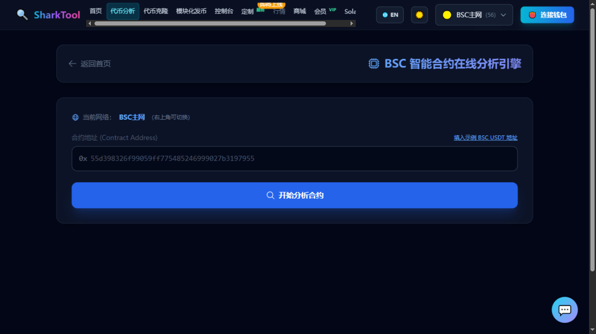

# Token Analyzer

**Entry**: top nav "Token Analyzer"

Paste a contract address and get an on-chain health report: basic info + 14 risk checks. Use it to quickly judge "whether this token is safe to touch".

**Cost**: Free. **No wallet connection needed** (a pure on-chain read-only query; no transaction is ever sent).

---

## Steps

1. First, **pick a network in the top-right** (BSC Mainnet, Ethereum, Polygon, Arbitrum, Base, etc.). The top of the page shows "Current network: XXX (switchable in the top-right)".
2. Paste the token contract address into the **"Contract Address"** field. The `0x` prefix is already filled in on the left side of the field.
3. If you don't want to copy an address from BscScan, click the small **"Fill in example XXX address"** text on the right — it fills in that chain's USDT example address (USDC on Base) in one click.
4. Click **"Start Analyzing Contract"**.
5. Wait for the on-chain query to finish (the button becomes "Analyzing contract on-chain…"). When done, you'll see **"Contract analysis successful!"**.

---

## How to read the results

### Basic info

Includes: Token Name, Symbol, Chain, contract address (click to copy), total supply, decimals, burned ratio, contract ownership, whether the contract is open-source, contract name, compiler version, open-source license, and proxy implementation address.

Two points are worth noting:

- **Whether the contract is open-source**: shows "Code is open-source" or "Not open-source / cannot audit". To use "Token Cloner", the contract **must be open-source**.
- **Contract creator**: block explorers don't currently provide this info, so it shows `-`; check the creation transaction if you need it.

### Risk analysis (14 checks)

Each item gives a "Safe / Risky / Needs confirmation" verdict:

| Check | What it means |
|---|---|
| Buy tax / sell tax | The tax deducted when you buy or sell |
| Currently a honeypot | Can buy but can't sell |
| Can modify the tax rate | Owner can later raise the sell tax to an extreme level |
| Restricts large transactions | Per-transaction / holding caps |
| Can reclaim admin authority | Whether authority can be taken back |
| Has an address blacklist | Owner can blacklist addresses |
| Whitelist-only selling | Only whitelisted addresses can sell |
| Can mint more to dump | Whether supply can be created out of thin air |
| Is a proxy contract | Logic can be replaced |
| Can pause trading | Owner can halt trading with one click |
| Has trading cooldown | Limits how often you can trade |
| Source can be audited | Whether the code can be inspected |

> ⚠️ The on-page notice is worth reading: **"Can pause trading" and "Can modify the tax rate" are the higher-risk items** — if the owner raises the sell tax to 99% it becomes a honeypot, and pausing trading also turns it into a honeypot.
>
> Results are based on local bytecode / ABI signature detection and are **for reference only, not investment advice**.

---

## Want to clone this token after analysis?

Below the results there's a **"Clone this token?"** card. Click **"🚀 Clone this token"** to jump to the Token Cloner page with the address you just analyzed pre-filled.

The contract must be **open-source**. See [Token Cloner](launch.md) for the full flow.

---

## Common messages

| Message | Cause |
|---|---|
| `Please enter a valid contract address` | Address is empty or malformed |
| `Contract analysis failed, please check RPC or network connection` | On-chain node error; retry later |
| Contract not open-source | Only basic info is visible; source-level clone is unavailable |
