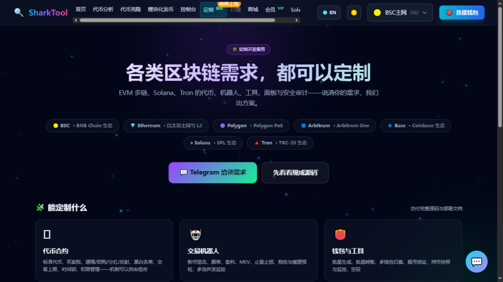

# Custom

**Entry**: top nav "Custom"

Beyond the self-service tools, SharkTool also takes on a wide range of custom blockchain development work.

---

## What we can build

| Direction | Examples |
|---|---|
| **Token contracts** | Contracts with tax, dividends, anti-snipe, or custom mechanics |
| **Trading bots** | Monitoring, sniping, copy-trading, and automated trading bots |
| **Wallets & tools** | Batch wallets, batch transfers, consolidation, vanity addresses, and more |
| **DEX & liquidity** | Pool creation, pool removal, liquidity management, market-making scripts |
| **Frontend & dashboards** | Data dashboards, admin panels, monitoring boards |
| **Security & audit** | Contract risk detection, code audit |

## Supported networks

BSC · Ethereum · Polygon · Arbitrum · Base · Solana · Tron

---

## Delivery process

1. **Discuss requirements** — tell us what you want to build, which chain it runs on, and the expected result
2. **Estimate & quote** — confirm the technical approach, timeline, and cost
3. **Develop & integrate** — progress is shared during development, with milestone acceptance available
4. **Deliver & support** — deliver a working product plus the necessary usage instructions

---

## Contact

The page provides a Telegram contact — just reach out directly. You can also describe your needs via the message bubble in the bottom-right corner of the website.
