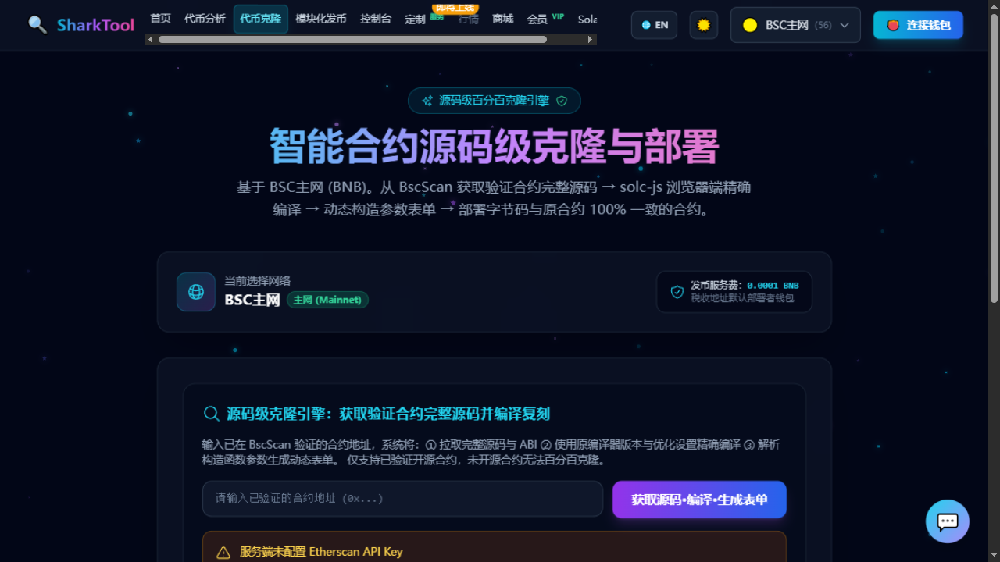

# Token Cloner

**Entry**: top nav "Token Cloner" (you can also get here by clicking "🚀 Clone this token" on the Token Analyzer results page)

**Source-level 100% clone**: pull the open-source contract source, compile it precisely in your browser, fill in the parameters, and deploy a new token whose **bytecode is identical to the original contract**.

**Prerequisites**:

- **You must pick a network in the top-right**, and this feature only fully supports **BSC Mainnet / BSC Testnet**.
- **You must connect a wallet** (MetaMask or scan), as deployment and fees are signed by your wallet.
- **The contract must be open-source** — a closed-source contract cannot be cloned.
- **Fee**: a platform service fee is charged; the exact amount is what the page and wallet popup show. Free while your Membership is active.

---

## Steps

### Step 1: Get the source and compile

1. Paste the contract address into the "Source-level clone engine" field (placeholder: `Please enter a verified contract address (0x...)`).
2. Click **"Get source · Compile · Generate form"**. The button then shows "Getting source..." → "Compiling source..." → "Analyzing...".
3. On success you'll see **"✅ Source fetched, compiled, and constructor parameters parsed! 100% clone is ready"**, and a "100% clone" badge appears showing the contract name, compiler version, optimizer settings, and constructor parameter count.

### Step 2: Choose a clone method

The page offers three methods, defaulting to the first:

| Method | What it does |
|---|---|
| **Source clone** (default) | Compiles the original contract source; bytecode is 100% identical. **Recommended** |
| **Simple template** | Standard ERC20; just fill in name, symbol, decimals, total supply |
| **Full template** | A template with tax / limits / trading switch; you can fill in contract owner, tax wallet, buy tax, sell tax, max transaction amount, max wallet, and whether trading is enabled |

### Step 3: Fill in the parameters

When you choose "Source clone", the page automatically lists:

- **Constructor parameter definitions**: a form is auto-generated from the original contract's ABI, with the original on-chain values pre-filled.
- **Source hard-coded parameters**: tax rates, wallet addresses, supply caps, etc. that are hard-coded in the source, pre-filled with the original values and editable.

Each parameter has a **"🤖 Explain"** button next to it — click it to get an explanation in Chinese of what this parameter is and how to fill it in. At the top, **"🤖 AI Explain All Parameters"** explains them all at once.

> Some parameters are complex expressions (referencing other constants or computed results); these are marked "Not editable for now — kept as-is at deploy time".

### Step 4: Confirm the deploy wallet

The page shows a **"Deploy wallet"** block. When connected, it shows your address and connection method; when not connected, it prompts you to connect in the top-right first.

> Deployment and fee payment are both signed via the wallet popup — **no private key input needed**.

### Step 5: One-click deploy

1. Click **"One-click deploy 100% source-level clone contract"** (in template mode the button reads "One-click deploy template clone contract").
2. During deployment you'll see "Deploying clone contract (step X/2)...".
3. **If deploying on Mainnet, a confirmation dialog appears first**, reminding you that you're paying real gas fees; confirm to continue.
4. The fee process involves **two transactions**: first the service fee is sent, then the deploy transaction (Membership users skip the fee, so only the deploy transaction remains).
5. On success: **"🎉 Congratulations! Clone contract deployed successfully!"**.

### Step 6: Get your results

The success card shows:

- **New contract address** — with a "Copy address" button
- **Deployment transaction hash** — with a "Copy hash" button
- **Deployer and tax ownership** — tax is automatically bound to the deployer wallet

Want to launch another? Click **"Continue deploying a new contract"**.

---

## After deployment: manually verify the contract (optional)

The new contract isn't necessarily auto-verified by default. The success card has a whole **"Contract verification info (for manual verification on a block explorer)"** block, listing each field required by the block explorer's "Verify & Publish Contract Source Code" form:

- Compiler type, compiler version, open-source license, EVM version, optimization toggle, Optimizer Runs (each with a copy button)
- **Solidity Contract Code**: "Download source" or "Copy all source"
- **Constructor Arguments ABI-encoded**: "Copy ABI encoding"; if the contract has no constructor parameters, leave this field empty

> If the code spans multiple files, the page will tell you to use the block explorer's "SOLIDITY MULTI-PART VERIFIER" and paste the JSON-formatted source.

---

## Common messages

| Message | Cause / what to do |
|---|---|
| `Please enter the contract address to clone` / `Invalid contract address format` | Address is empty or incorrect |
| `This contract is not open-source; 100% clone is unavailable` | Choose an open-source contract instead |
| `Multi-file contracts are not supported: please choose a single-file contract` | The contract has a multi-file structure, not yet supported |
| `Compilation failed: ...` | Source fails to compile; contact support |
| `Please complete the contract analysis first` | You skipped the "Get source · Compile" step |
| `Please connect a wallet first (MetaMask or scan)` | Connect your wallet in the top-right |
| A message about a missing block explorer key | The platform-side API isn't ready; retry later or contact support |

---

> **Disclaimer**: This tool is for technical learning and legitimate contract deployment testing only. You are responsible for the compliance, security, and tokenomics of the contracts you deploy. A 100% clone only guarantees that the bytecode matches the compiled source — **it does not guarantee the safety of the contract's business logic**.
