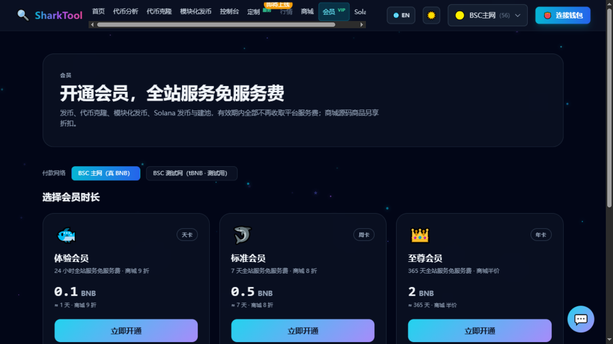

# Membership

**Entry**: top nav “Membership VIP”

Once your Membership is active, **every pay-per-use token launch / pool creation service on the site is free for the duration of your Membership**, and **source-code products in the Shop get a tier discount**.

**No wallet connection needed**: payment goes to the platform's fixed payment address, and your Membership credential is stored in this browser and works across the whole site.

---

## Three Membership tiers

| Tier | Duration | Price | Benefits | Shop discount |
|---|---|---|---|---|
| 🐟 **Day Pass** | 1 day | 0.1 BNB | Service fees waived site-wide for 24 hours | 10% off |
| 🦈 **Weekly** | 7 days | 0.5 BNB | Service fees waived site-wide for 7 days | 20% off |
| 👑 **Annual VIP** | 365 days | 2 BNB | Service fees waived site-wide for 365 days | 50% off |

**Free coverage includes**:

- EVM token cloning
- EVM modular launch
- Solana token launch
- Solana pool creation

**Unlimited use while your Membership is active** — not just once.

---

## Activation steps

1. Go to the “Membership VIP” page and click **“Get it”** (if you are already a member it shows **“Extend”**).
2. The page creates an order and shows:
   - **Payment QR code**
   - **Amount due** (one-click copy)
   - **Payment address (the platform's fixed address)** (one-click copy)
   - **Payment countdown**
3. **Transfer the exact amount shown from your wallet** (the page notes: even one cent less won't be credited).
4. After transferring, you don't need to do anything — the page automatically watches for the on-chain payment and, once it arrives, shows **“🎉 Membership activated”**.

> 💡 **The payment address is the platform's fixed address**, not generated separately for each order.
> Each order's **amount due carries a unique amount tag** (for example `0.1` is shown as `0.100037`) — that is the order's identifier.
> The system uses it to match the incoming payment to the order, so the key is to **transfer the exact amount including the decimals**; don't round the tag off to a whole number.

---

## Extending

If you buy again while your Membership is still active, **the duration stacks and is not overwritten**. So if you want two Day Passes, buy twice — 2 days in total.

---

## Membership status

Once activated, the top of the page shows: your current tier, **valid until XXXX-XX-XX**, **X days remaining**, and “✅ Service fees waived site-wide”.

### About “Clear this device's pass”

The page offers a “Clear this device's pass” button. Note:

- Your Membership credential is **stored in this browser**, works site-wide and **is not tied to a wallet address**.
- **Clearing site data, switching browsers or switching devices will lose your Membership**, and you will need to buy it again.
- Do not share your credential with others.

---

## Common messages

| Message | Meaning |
|---|---|
| `Order created, please transfer the amount below` | Order placed successfully — go ahead and transfer |
| `🎉 Membership activated` | Payment received successfully |
| `Order expired, please place a new order` | Timed out without payment — place a new order |
| `Order failed: ...` | Try again later or contact support |

---

## Related

- Want to know the regular price of each service? → [Service Fees](fees.md)
- Want to know how much the Membership discount saves you? → [Source-code Shop](shop.md)
