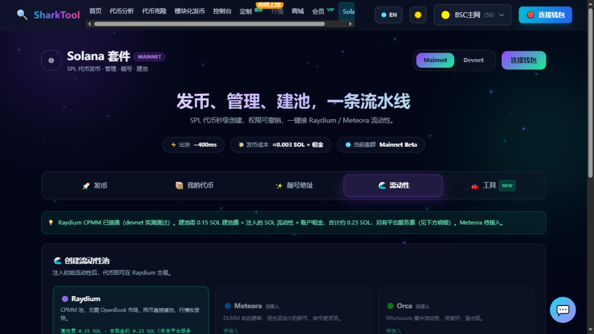

# Solana Liquidity

**Entry**: top nav “Solana” → “🌊 Liquidity” tab

Create a real liquidity pool for your SPL token and add the initial liquidity — and withdraw it again at any time (burn LP to redeem both tokens).

**Prerequisites**:

- Connect a **Solana wallet**.
- Choose **Mainnet / Devnet** at the top of the Solana page.
- **Fees**: Raydium pool creation fee + the liquidity you add + account rent, plus a platform service fee (the page shows the breakdown). The platform service fee is waived while your Membership is active.

---

## Supported DEXes

| DEX | Status |
|---|---|
| **Raydium** | Live (CPMM pool, no OpenBook market needed) |
| **Meteora** | Coming soon |
| **Orca** | Coming soon |

> Creating a Raydium pool needs **0.15 SOL pool creation fee + the SOL liquidity you add + account rent**, about 0.23 SOL in total (excluding the platform service fee).

---

## Creating a pool

1. Choose **Raydium**.
2. Fill in the pool form:

| Field | Description |
|---|---|
| **Token** | Pick the token you want to pool from the dropdown |
| **Initial SOL deposit** | How much SOL goes into the pool |
| **Initial token deposit** | How much of the token goes into the pool |
| **Initial price** | Calculated automatically from the two values above (read-only) |

3. Check the **fee breakdown** on the right: pool creation fee, liquidity deposit, account rent, platform service fee, total.
4. Click **“🌊 Create pool and add liquidity”** and confirm the signature in your wallet.
5. **Creating a pool on Mainnet shows a confirmation dialog** that clearly states you will spend real SOL (non-refundable pool creation fee, deposit amount, rent, etc.). Continue after confirming.
6. On success you'll see **“🎉 Liquidity pool created”**.

---

## My Liquidity

Once created (or once you add an external pool manually), the pool appears in the “My Liquidity” section:

- Shows the pool, your LP amount and share.
- **Withdraw**: withdrawing = burning LP to redeem both tokens by share.
  - You can enter a “withdraw LP amount”, or click **“All”** to withdraw everything at once.
  - Clicking **“✕”** only removes the record from the list and **does not affect the on-chain pool**.
- **Add an existing pool**: paste a pool address and click “Add” to bring a pool you created elsewhere in here for management too.

> ⚠️ The amounts of the two tokens you get back on withdrawal **change with the market**, and **the pool creation fee is not refunded**. Withdrawing on Mainnet is a real on-chain action — please confirm before proceeding.

---

> 🧰 Operations tools such as batch send, airdrop, consolidate, holder analysis and authority check are already live — see [Solana Tools](solana-tools.md).
