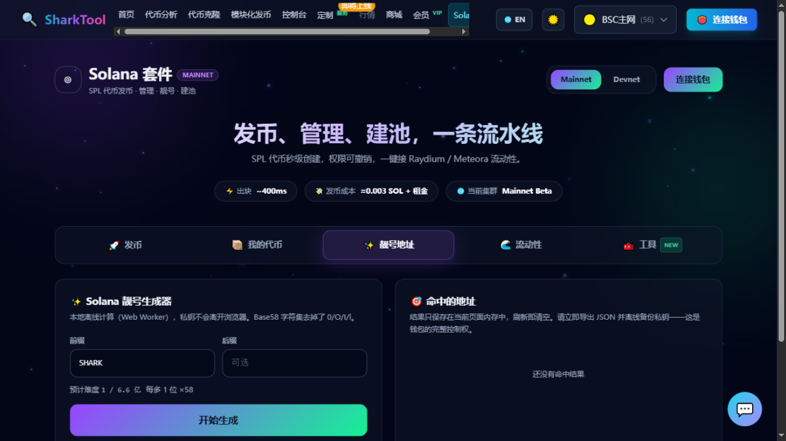

# Solana Vanity Address

**Entry**: top nav “Solana” → “✨ Vanity” tab

Generate a Solana wallet address that starts or ends with characters you choose, for example one starting with `SHARK`.

**Cost**: free. **Computed entirely locally — no wallet connection and no on-chain transaction.**

> 🔐 **Your private key never leaves your browser**. Generation happens entirely on your own computer.

---

## Steps

1. Enter a **“Prefix”** (the default is `SHARK`); the **“Suffix”** is optional.
2. The page shows the **estimated difficulty** in real time with the hint “×58 for every extra character” — each extra character you specify multiplies the difficulty by 58.
3. Click **“Start generating”** and the page shows “Tried XXX times · Running”. Click “Stop” whenever you want to stop.
4. On a hit you'll see **“🎉 Vanity address found XXXX”**, and it appears in the “Found addresses” list on the right.
5. Click the **“Export”** button on each result to download a JSON file you can import directly into Phantom / Solflare.

### Character set

Solana uses Base58, **with the easily confused `0`, `O`, `I` and `l` removed**.

### Difficulty tips

- If the prefix + suffix **add up to more than 5 characters**, the difficulty is extremely high and it may never finish; the page will prompt you to reduce the characters.
- The more positions, the slower it gets. We suggest starting with 2–3 characters.

---

## ⚠️ First thing after you get a result: export and back it up offline

Please follow the on-page warning:

> The result **is kept only in the current page's memory and is cleared on refresh**. Export the JSON and back up the private key offline immediately — **this is full control of the wallet**.

The exported JSON is the wallet's private key file. Anyone who gets it can move the assets inside, so please:

- export it immediately, without refreshing the page;
- keep it in an offline, encrypted location;
- don't screenshot it, don't send it to chat tools, don't upload it to cloud storage or any website.

---

## Common messages

| Message | Description |
|---|---|
| `Please enter at least a prefix or a suffix` | Both are empty |
| `Prefix + suffix exceeds 5 characters, difficulty is extremely high (may never finish), please reduce the characters` | Reduce the characters |
| `No result yet` | Keep waiting, or lower the difficulty |

---

> A vanity address only makes your address “look nice”; **it changes nothing about security or functionality**. Weigh the time cost sensibly, and keep your private key safe.
