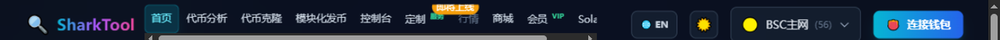

# 快速开始

开始使用任何一个功能之前，只需要三件事：**连接钱包**、**选对网络**、**认识右上角那几个按钮**。

---

## 一、连接钱包

在页面右上角找到 **「👛 连接钱包」** 按钮，点开后会看到两个选项：

| 选项 | 适用场景 |
|---|---|
| **🦊 MetaMask / 浏览器钱包** | 电脑上使用。支持 MetaMask、OKX、Trust、Coinbase 等浏览器插件钱包 |
| **📱 扫码连接 (WalletConnect)** | 手机上使用。用手机钱包扫二维码即可连上电脑网页 |

- 连接成功后，右上角会显示你的地址缩写（如 `0x1234...abcd`）。
- **连接一次，全站通用**：之后所有功能都不需要重复连接。
- 刷新页面会自动恢复上次的连接状态，不会反复弹窗。

> 🔐 **私钥始终保存在你的钱包里，本网站无法接触。** 所有需要花钱或改链上状态的操作，都会弹出钱包让你确认。

### 断开连接

点右上角自己的地址，菜单里有 **「🔌 断开连接」**；菜单里还有 **「📋 复制地址」**。

---

## 二、选择网络

右上角的下拉按钮显示当前网络，例如 **「🟡 BSC主网 (56)」**。点开可以切换：

| 网络 | 说明 |
|---|---|
| 🟡 BSC主网 | BNB Smart Chain，最常用 |
| 🧪 BSC测试网 | 练手专用，可免费领测试币 |
| 💎 Ethereum | 以太坊主网 |
| 🟣 Polygon | Polygon 主网 |
| 🔵 Arbitrum | Arbitrum One |
| 🔷 Base | Base 主网 |

已连接的 Solana 是**独立的一套**，不走这里的链选择器——见下方「四、Solana 钱包」。

### 切换网络时会自动同步钱包

在网站上切网络后，网站会请求你的钱包一起切过去，并给出提示：

- `正在自动切换钱包到 XXX...`
- `钱包已自动切换到 XXX`
- 如果钱包不支持自动切换，会提示你在钱包里手动切换。

> ⚠️ 发币、建池这类操作前，请确认**网站右上角的网络**和**钱包里的网络**是同一个，否则交易会失败。

---

## 三、语言与主题

右上角还有两个小按钮：

- **语言切换**：中文界面显示 `🌐 EN`，点了切成英文；英文界面显示 `🌐 中文`。
- **主题切换**：暗色主题显示 `☀️`，亮色主题显示 `🌙`。

两个设置都会被记住，下次打开保持上次的选择。

---

## 四、Solana 钱包

Solana 功能（发币、靓号、建池）在 **「Solana」** 页面内，需要单独连接 Solana 钱包。

进入 **Solana** 页面后点 **「连接钱包」**，支持三种钱包：

| 钱包 | 说明 |
|---|---|
| **Phantom** | 最流行的 Solana 钱包 |
| **Solflare** | 支持质押与硬件钱包 |
| **Backpack** | xNFT 生态钱包 |

- 没安装的钱包会显示「未安装」，点击会打开对应的安装页面。
- 连接后按钮上会显示地址和余额，再点一次即可断开。
- 页面顶部可以切换 **Mainnet（主网）** 和 **Devnet（测试网）**。切到 Devnet 后会出现 **「💧 领测试币」** 按钮，可以免费领 1 SOL 练手。

> ⚠️ 记得**在钱包里也把网络切到同一个集群**（主网/测试网），否则余额和交易会对不上。

---

## 五、右下角的留言入口

页面右下角有个悬浮球，点开可以给站长留言反馈。提交后不需要注册、也不需要连接钱包。

---

## 下一步

- 想查币？→ [代币分析](analyze.md)
- 想发币？→ [代币克隆](launch.md) 或 [模块化发币](builder.md)
- 想省钱？→ [会员中心](membership.md)
