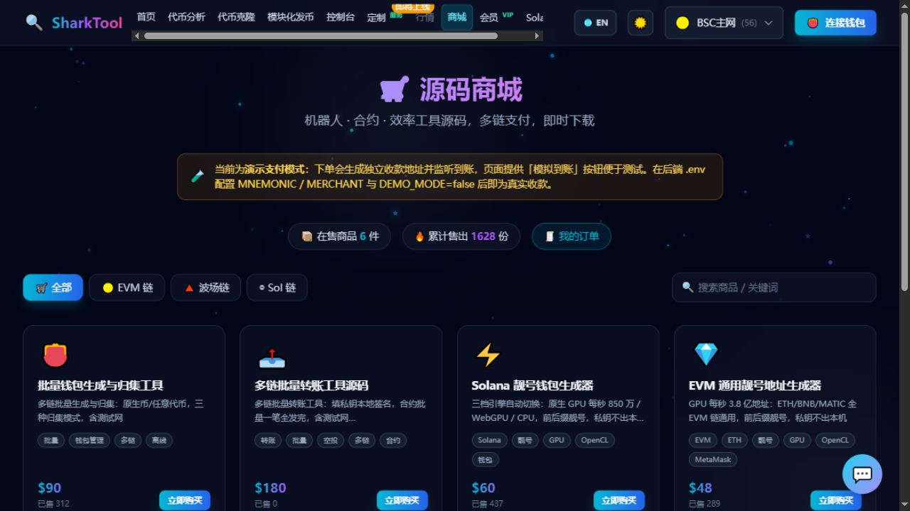

# 源码商城

**入口**：顶部导航「商城」

购买经过实战使用的工具源码：机器人、合约、效率工具。多链支付，支付成功即时解锁下载。

> 📌 商品与价格**以商城内实时显示为准**。会员在商品上会额外看到「会员价」。

---

## 在售商品

| 商品 | 说明 | 价格 |
|---|---|---|
| **批量钱包生成与归集工具** | 多链批量生成与归集：原生币 / 任意代币，三种归集模式，含测试网 | $90 |
| **多链批量转账工具源码** | 填私钥本地签名，合约批量一笔全发完，含测试网（BSC/ETH/Polygon/Arbitrum） | $199 |
| **Solana 靓号钱包生成器** | 三档引擎自动切换：原生 GPU / WebGPU / CPU，前后缀靓号 | $129 |
| **EVM 通用靓号地址生成器** | GPU 加速，ETH / BNB / MATIC 全 EVM 链通用，前后缀任意组合 | $229 |
| **波场 TRON 靓号地址生成器** | GPU 加速，TRX / TRC20 靓号（T 开头），前后缀组合匹配 | $199 |
| **波场转账监控机器人** | 批量地址 · 多代币 · 收入 / 转出 / 双向，Telegram 实时推送 | $299 |

价格以**美元标价**，下单时按**实时汇率**折算成你选的支付币种（BSC BNB / USDT、Tron USDT、Solana SOL / USDT），实际应付数量以付款页显示为准。会员在商品卡上会额外看到**会员价**。

---

## 支持的支付方式

下单时可选：

- BSC BNB
- BSC USDT（BEP20）
- Tron USDT（TRC20）
- Solana SOL
- Solana USDT（SPL）

---

## 购买步骤

1. 在商城页用**分类**（全部 / EVM 链 / 波场链 / Sol 链）或**搜索框**找到商品。
2. 点商品卡查看**详情**：版本、大小、更新时间、评分、功能亮点、源码包内容。
3. 点 **「💳 立即购买」**。
4. 在弹窗里**选择支付方式**（显示币种 + 链名）。
5. 页面显示**平台收款地址**（每条链一个固定地址）和二维码，进入 **「等待支付到账」** 界面：
   - 按 **应付数量** 精确转账
   - 有支付倒计时
   - 页面会自动监听链上到账，**确认后自动解锁下载，无需手动操作**
6. 到账后提示 **「支付成功，源码已解锁」**，点 **「⬇ 立即下载源码」** 即可下载。

> 💡 收款地址是全站共用的固定地址，不是每单单独生成。
> 每笔订单的**应付金额都带一段独有的零头**（如 `0.1515` 会显示成 `0.151537`），这就是该订单的识别码 ——
> 系统靠它把链上到账对回对应订单，所以请**连小数一起精确转账**，不要抹掉零头。

### 已付款但没自动到账？

支付弹窗里有一个折叠项 **「已付款但未自动到账？手动提交交易哈希」**：粘贴交易哈希点提交，系统会校验收款地址与金额后立即解锁。

---

## 我的订单

点页面上的 **「🧾 我的订单」** 可以查看历史订单，包含商品、时间、金额、交易链接和下载入口。

- **连接了钱包**：订单与钱包地址绑定，可跨设备查看。
- **未连接钱包**：订单保存在本浏览器。

---

## 源码包与下载安全

- 源码包通过**限时签名链接**下发，不暴露公开下载入口。
- 一个订单对应一次授权下载，请及时保存源码包。

---

## 购买须知

> 支付即表示同意：**源码为虚拟商品，付款成功后不支持退款**；仅限购买者本人使用，**禁止二次售卖**。

购买遇到问题，可在商城页脚找到客服 Telegram 联系方式。

---

## 会员折扣

会员在商城内享**等级折扣**（天卡 9 折 / 周卡 8 折 / 年卡半价），商品卡上会直接显示会员价。

详见 [会员中心](membership.md)。
