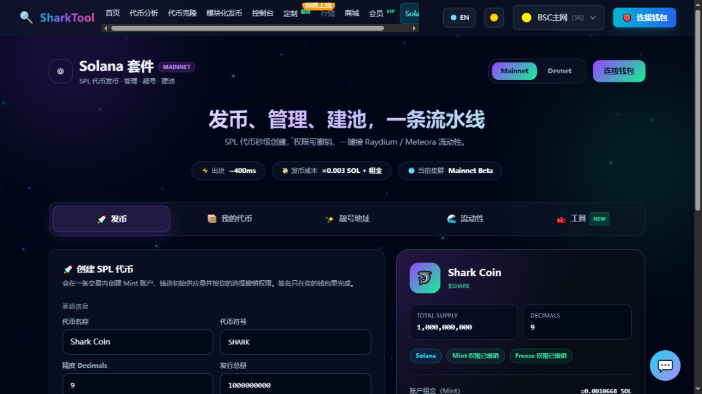

# Solana 发币

**入口**：顶部导航「Solana」→「🚀 发币」页签

在 Solana 上创建真实的 SPL 代币：**一次签名**完成创建 Mint、初始化、创建代币账户、铸造、写入链上元数据，可选撤销权限。

**前置条件**：

- 连接 **Solana 钱包**（Phantom / Solflare / Backpack）——Solana 用的是独立钱包，和 EVM 那套钱包不同。
- 页面顶部切换 **Mainnet（主网）** 或 **Devnet（测试网）**。建议先在 **Devnet** 练手，可以免费领 1 SOL 测试币。
- **收费**：平台服务费 + 链上租金与网络费。会员有效期内免平台服务费。

---

## 操作步骤

### 1. 填写代币信息

| 字段 | 说明 |
|---|---|
| **代币名称** | 会写入链上元数据 |
| **代币符号** | 例如 SHARK |
| **精度 Decimals** | SPL 代币通常用 9 |
| **发行总量** | 需要以后增发就保留铸币权限 |
| **简介** | 会写入链上元数据 |
| **代币图标** | 建议 512×512 方形 PNG/JPG，≤512KB |

### 2. 选择权限

- **撤销铸币权（Mint Authority）** —— 推荐勾选，表示弃权后无人能再增发。
- **撤销冻结权（Freeze Authority）** —— 弃权后无人能冻结你的持币地址。

### 3. 看清费用明细

页面右侧会列出这笔交易的全部成本，逐项透明：

- 账户租金（Mint）
- 账户租金（代币账户 ATA）
- 账户租金（Metaplex 元数据）
- 网络交易费
- **平台服务费**（会员显示「会员免费」）
- **合计**，以及你的**钱包余额**

> 代币图标与元数据的存储费由你的钱包支付（金额很小），页面会一并列出。

### 4. 创建

点 **「🚀 创建代币」**（副文案：一次签名完成创建 · 失败自动回滚），依次会看到：

`正在连接存储服务…` → `上传图标与元数据…` → `提交创建交易，请在钱包确认…`

成功后提示 **「🎉 代币已创建，元数据已上链」**，并给出 Mint 地址、交易链接、元数据链接。

> 💡 创建后 Phantom 等钱包显示名称/图标可能有索引延迟，稍等即可。

---

## 📦 我的代币

**入口**：Solana 页面 →「📦 我的代币」页签

这里列出你在本平台创建过的代币，**供应量与权限都是链上实时查询结果**：

- 表格列：代币、Mint 地址、链上供应量、权限、操作。
- 权限徽章：`可增发` / `已弃铸币权`、`可冻结` / `已弃冻结权`。
- 操作：「交易」跳转区块浏览器；「移除」只从本地列表删掉，**不影响链上代币**。

---

## 常见提示

| 提示 | 说明 |
|---|---|
| `请先连接 Solana 钱包` | 先去连接钱包 |
| `请填写代币名称与符号` | 必填项为空 |
| `发行总量需大于 0` | 数量填错 |
| `余额不足：切到 Devnet 可领测试币` | 钱包余额不够付租金和手续费 |
| `你在钱包里取消了签名` | 正常取消，重试即可 |

---

## 相关

- 想要好看的地址？→ [Solana 靓号地址](solana-vanity.md)
- 想给代币建池交易？→ [Solana 流动性](solana-liquidity.md)
