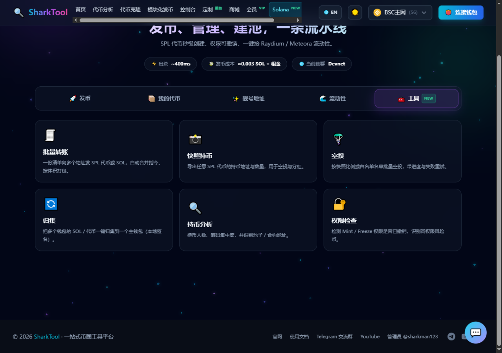

# Solana 工具

**入口**：顶部导航「Solana」→「🧰 工具」页签

六个链上运维工具，解决发币之后真正要干的事：把代币发给一批人、看谁拿着币、把散在各处的钱包收回来、检查一个币的权限有没有留后门。

**费用**：全部**免费**，平台不收服务费（只有链上本身的网络费与账户租金要你自己付）。

---

## 🧾 批量转账

一份清单，向多个地址发 SPL 代币或原生 SOL。

**操作步骤**

1. 选 **「SPL 代币」** 或 **「原生 SOL」**。
2. 发代币时填 **代币 Mint 地址**（也可以点下面「我的代币」里的快捷按钮）。
3. 在清单里按 **每行「地址,数量」** 粘贴，或点 **「导入 CSV」** 直接读文件。
   - 支持逗号 / 空格 / 制表符分隔；`#` 开头的行与表头会被自动跳过；
   - 重复地址会自动去重，非法地址会单独列出来（不会混在有效行里）。
4. 点 **「预检查代币账户」**：没建过该代币账户的地址会提示数量与需要的租金（每个约 0.002 SOL，**由你的钱包出**，转账时会自动创建）。
5. 选签名方式后点 **「开始批量转账」**。

**两种签名方式**

| 方式 | 说明 |
|---|---|
| **钱包签名** | 连接 Phantom / Solflare / Backpack，每笔交易在钱包里确认一次。一笔交易会尽量塞满（十几条指令），页面会先告诉你**预计要确认几次**。 |
| **私钥本地签名** | 粘贴私钥，在浏览器里直接签，**不弹钱包确认框**。地址多的时候用这个才跑得动。私钥只在当前页面内存里，不上传、不存储、刷新即失。 |

**说明**

- 「每笔最多几条」只是上限，实际会按交易体积自动收窄（创建代币账户的指令更占地方，写死条数会超过 Solana 的单笔体积上限）。
- 失败的行会单独列出原因，可以**复制失败地址**或**一键重试失败项**。

---

## 📸 快照持币

导出任意 SPL 代币的**持币地址与数量**，用于空投、分红、快照投票。

1. 填代币 Mint 地址。
2. 点 **「抓取持币快照」**。页面显示 **持币人数、代币账户数、总量、精度**，并按持仓从多到少列出（同一地址的多个账户会合并计算）。
3. **「导出 CSV」** 下载全部（地址 / 数量 / 占比），或 **「复制地址列表」** 只取地址。
4. 拿到的快照可以直接切到 **「🪂 空投」** 使用。

> 💡 快照是**当下这一瞬间**的持仓。代币转账后需要重新抓取。

> ⚠️ **主网抓全量快照需要带 Key 的 RPC 节点**。全量持币扫描属于「索引类查询」，公共主网节点要么不支持、要么要求个人 token（官方节点还会直接拒绝浏览器请求）。没有配带 Key 的节点时，这一步会失败并给出提示；**想先试功能可以先切到 Devnet**。

---

## 🪂 空投

按快照比例或按名单发放代币。

| 来源 | 分配方式 |
|---|---|
| **按持币快照** | 填「空投总量」，按每个持有人**当时的持仓比例**分配；可设**最小发放量**（低于这个数的人直接不发，避免制造一堆灰尘）；可勾选**排除池子 / 合约地址**（默认勾上，不把空投扔进流动性池）。 |
| **按地址名单** | 每行一个地址，每人**固定数量**。 |

- 发送前会显示**分配预览**（人数 + 合计 + 前几行明细），确认无误再点「开始空投」。
- 发送过程、签名方式、失败重试与批量转账一致。

---

## 🔄 归集

把**多个钱包**里的 SOL / 代币，一次性收回到一个主钱包。

> ⚠️ 归集只能靠**私钥本地签名**——一个钱包签不了另一个钱包的交易。
> 私钥只在本页内存里用，不上传、不存储；**用完后请点「清空私钥」并刷新页面**。

1. 填 **归集目标地址**（连了钱包的话默认就是当前钱包）。
2. 选归集内容：**SOL + 代币** / 只 SOL / 只代币（只代币时需要填代币 Mint）。
3. 粘贴**私钥清单**，每行一个，支持两种格式：
   - `solana-keygen` 生成的 JSON 数组（`[12,34,…]`）
   - base58 私钥（64 字节）或 base58 种子（32 字节）
   - 也可以点「导入 CSV」读文件
4. 确认弹窗后开始。每个钱包一笔交易，逐个显示结果与交易链接。

**要知道的取舍**

- 每个来源钱包会**被扫到 0 SOL**（只扣掉一笔网络费），这样才能把钱全部取走。
- 因此**执行前请确认这些钱包以后不再需要付手续费**。
- **空代币账户里的租金（每个约 0.002 SOL）不会一起取出**：要走这笔钱需要单独关闭账户，本工具不代劳。
- 顺序是先转代币、再扫 SOL（反过来的话就没钱付代币转账的手续费了）。

---

## 🔍 持币分析

看一个币的**筹码结构**。

- **持有人数 / 代币账户数 / 总量**
- **集中度**：第一大、前 5、前 10、前 20 的占比，以及**扣除池子后的前 10 占比**（这个数字才是真实筹码集中度）与「高度集中 / 中度集中 / 较分散」评级。
- **前 20 大持仓明细**，并标注每个地址的**类型**：`钱包`，还是 `Raydium CPMM` / `Orca Whirlpool` / `Meteora DLMM` / `Pump.fun` 等**池子 / 合约地址**。

> 说明：池子识别靠「这个地址的账户所有者是不是系统程序」判断——普通钱包是系统账户，而 DEX 池子的金库由各自的程序持有。
> **这里不做「老鼠仓 / 捆绑」分析**：那需要历史成交与转账关系，公共 RPC 节点不提供这些数据。

---

## 🔐 权限检查

判断一个币**留没留后门**，两项最关键的权限：

| 检查项 | 含义 |
|---|---|
| **铸币权（Mint Authority）** | 未撤销 = 有人还能增发，可以把你的份额稀释到接近 0。 |
| **冻结权（Freeze Authority）** | 未撤销 = 有人能把任意持币账户冻结，让你的代币转不出去。 |

- 权限持有者如果是**普通钱包**，风险提示会直说是「普通钱包：随时可以增发 / 冻结」；
- 如果是**程序账户（PDA）**，说明权限握在某个合约手里（例如联合曲线、挖矿合约），页面会说明这一点；
- 另外还会告诉你这是 **SPL Token** 还是 **Token-2022**、精度、总量，以及供应量是否为 0。

---

## 几个共同的注意点

- **节点能力有两处硬限制**（工具全部走浏览器直连的 Solana 节点，页面会在一个节点被限流时自动换下一个重试）：
  - **全量持币扫描（快照 / 持币分析）属于「索引类查询」**：公共主网节点不支持，官方节点还会拒绝浏览器请求。主网要用这两个功能，必须配置带 API Key 的节点（Helius / QuickNode 等）；**Devnet 可直接使用**。持币人数特别多的币即便配了 Key 也可能很慢，页面会在 30 秒后中止并说明原因。
  - 因此工具里**刻意避开了一切索引类方法**（例如读代币余额用的是账户数据本地解码，而不是 `getTokenAccountBalance`），保证批量转账、空投、归集这些**写操作**在公共节点上也能正常跑。
- **主网操作不可撤销**：批量转账、空投、归集都是真实上链。**建议先切到 Devnet**（页面顶部）用测试币把所有流程演练一遍，确认无误再上主网。
- **租金要自己付**：给还没有代币账户的地址转账/空投，会顺带创建账户，每个约 0.002 SOL 的租金从你的钱包扣，页面在发送前会提示数量与总额。
- **私钥安全**：批量签名与归集需要用私钥。私钥只在浏览器内存中使用，平台不接触、不存储；但请务必在**自己的电脑**上操作，用完后清空输入框并刷新页面。

---

## 常见提示

| 提示 | 说明 |
|---|---|
| `节点限流了（公共 RPC 对这类查询限制很严）` | 稍后重试，或换带 Key 的 RPC 节点 |
| `N 个地址还没有代币账户，发送时会自动创建` | 正常提示，租金由你出，可先小额试一笔 |
| `你在钱包里取消了签名` | 在钱包里点了拒绝；重新点发送即可 |
| `余额不足（SOL 不够付手续费，或代币账户租金不够）` | 给主钱包补一点 SOL |
| `这一笔交易装不下（指令太多）` | 把「每笔最多几条」调小 |
| `没有可归集的余额` | 该钱包里没有要归集的资产，会被计为「跳过」 |
